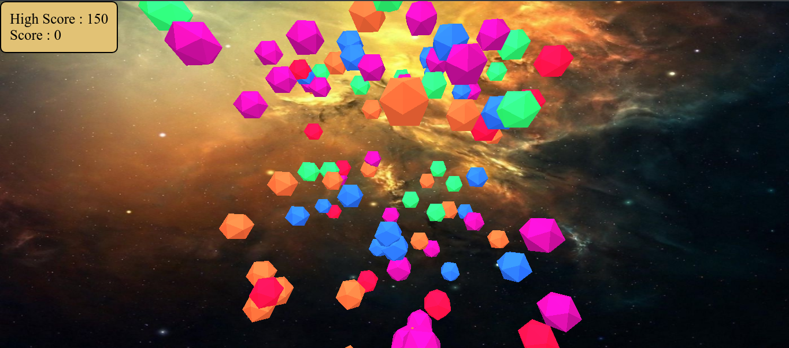

# LAPORAN TUGAS INDIVIDU INTERAKSI USER

Nama : Ahmad Lamaul Farid

NRP : 05111940000134

Kelas : Grafika Komputer D

---

## Keterangan

-   Membuat 50 object icosahedron geometry dengan warna dan posisi yang random
-   Object icosahedron geometry ini dibuat dalam rentang waktu tertentu, dimana semakin lama object tersebut akan dibuat semakin cepat
-   Object yang dipilih secara acak berpasangan dan memiliki warna yang sama akan dihilangkan dari scene dan skor akan ditambahkan 10
-   Jika ada object yang dipilih dan memiliki warna yang berbeda maka object tersebut tidak akan hilang dan tidak mendapatkan skor (0)
-   Penambahan object akan dilakukan terus-menerus sampai batas maksimal yang telah ditentukan, dimana disini maksimal penambahan object adalah 100
-   Skor maksimum akan dicapai bersamaan dengan mereset skor menjadi 0, saat semua object telah ditambahkan (maksimal 100) dan waktu yang ditentukan telah habis

## Hasil pengerjaan Tugas Individu Interaksi User

