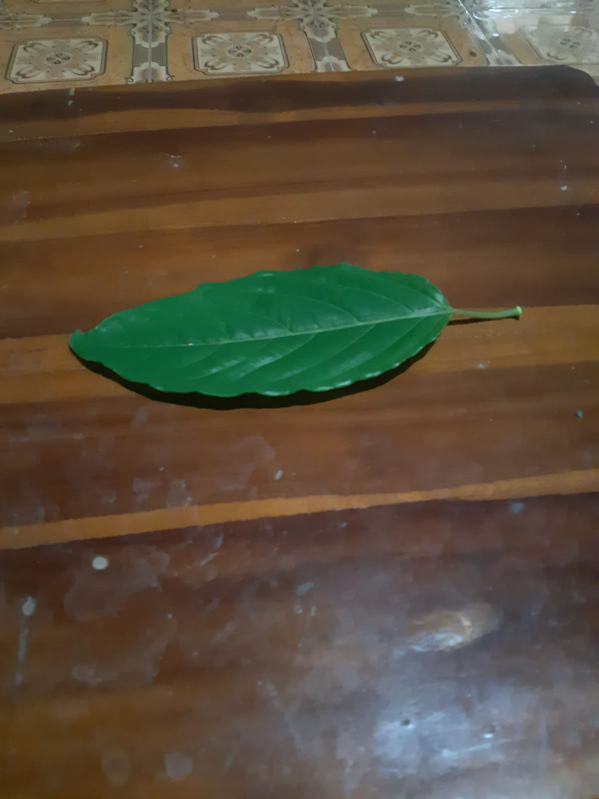

# LAPORAN TUGAS 1

Nama : Ahmad Lamaul Farid

NRP : 05111940000134

Kelas : Grafika Komputer D

---

## Hasil pengerjaan Lanjutan Tugas 1

Keterangan : 
- Pada gambar sebelah kiri menggunakan gambar daun dari sudut depan atas 
- Pada gambar sebelah kanan menggunakan gambar daun dari sudut kiri atas  

## Hasil Pengerjaan Tugas 1

Nama objek : Daun

-   Foto dari sudut kanan atas
    

-   Foto dari sudut kiri atas
    

-   Foto dari sudut belakang atas
    

-   Foto dari sudut depan atas
    
