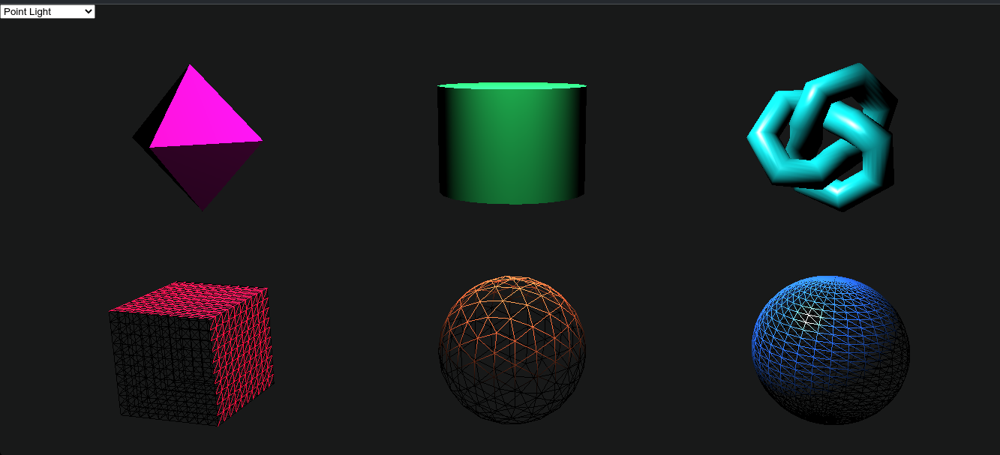

# LAPORAN TUGAS INDIVIDU THREEJS

Nama : Ahmad Lamaul Farid

NRP : 05111940000134

Kelas : Grafika Komputer D

---

## Instalasi

-   Jalankan command `npm install --save three` pada terminal
-   Folder `node_modules` harus terletak pada directory yang sama dengan file `index.html` dan `main.js`
-   Jalankan file `index.html` pada browser

## Hasil pengerjaan Tugas Individu Threejs

